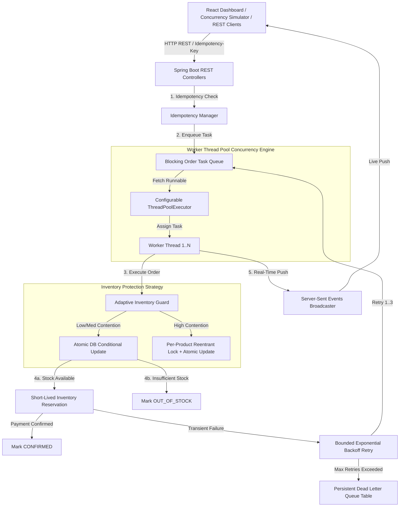

# ⚡ Concurrent Order Processing Engine & Adaptive Inventory Guard

> **Production-Grade Hackathon Prototype**  
> A high-throughput, fault-tolerant concurrent order-processing engine built with **Java 21**, **Spring Boot 3.3**, **PostgreSQL**, **React 18**, **TypeScript**, **Vite**, and **Tailwind CSS**.

---

## 🎯 Executive Summary & Problem Statement

In high-concurrency e-commerce environments (e.g. Flash Sales, Limited Edition GPU releases, Ticket drops), thousands of customers attempt to purchase scarce inventory at the exact same millisecond. Traditional CRUD architectures suffer from:
1. **Overselling & Negative Stock**: Race conditions where multiple concurrent worker threads read the same available quantity, calculate `stock - 1`, and write duplicate decrements.
2. **Database Thrashing**: Uncontrolled concurrent transactions causing lock wait timeouts and deadlocks.
3. **Double Orders**: Network retries creating duplicate order records.
4. **Unrecoverable Failures**: Transient network/DB outages crashing order pipelines without bounded retry and Dead Letter Queue (DLQ) safeguards.

This project delivers an enterprise-grade solution featuring a **Configurable Thread Pool Concurrency Engine**, **Atomic Database Concurrency Control**, an **Adaptive Inventory Guard**, **Short-Lived Stock Reservations**, **Idempotency Control**, **Bounded Exponential Backoff Retries**, and a persistent **Dead Letter Queue (DLQ)** with a real-time **Operations Dashboard** and **Concurrency Simulator**.

---

## 🏗️ Core System Architecture



---

## 🔬 Critical Technical Distinction

| Concept | Responsibility | Mechanism |
| :--- | :--- | :--- |
| **Thread Pool Executor** | Concurrent Order Execution | Handles $N$ concurrent HTTP requests using a fixed-size configurable `ThreadPoolExecutor` and worker threads (`Worker-1` to `Worker-N`). |
| **Inventory Concurrency Control** | Stock Oversell Protection | Ensures multiple worker threads cannot consume the same inventory item using **Atomic Conditional Database Queries**. |
| **Adaptive Inventory Guard** | Dynamic Contention Management | Monitors requests/sec & stock level per product. Serializes inventory checks for *high-contention products* to prevent DB lock thrashing. |

---

## 🛠️ Key Technical Features

### 1. Atomic Database Concurrency Protection
Instead of unsafe read-then-write logic, stock deduction uses atomic conditional SQL updates:
```sql
UPDATE inventory
SET available_quantity = available_quantity - :qty,
    reserved_quantity  = reserved_quantity + :qty,
    updated_at         = CURRENT_TIMESTAMP
WHERE product_id = :productId
  AND available_quantity >= :qty;
```
- **Result Evaluation**: If affected rows = `1`, allocation succeeded. If affected rows = `0`, stock was insufficient and order is marked `OUT_OF_STOCK`. Available stock **never becomes negative**.

### 2. Adaptive Inventory Guard
Tracks a 10-second sliding window of metrics per product:
- **LOW Contention**: Stock > 15 & requests/sec < 5 $\rightarrow$ Direct atomic processing.
- **MEDIUM Contention**: Stock $\le 15$ or requests/sec $\ge 5 \rightarrow$ High-frequency monitoring.
- **HIGH Contention**: Stock $\le 3$ or requests/sec $\ge 15 \rightarrow$ Applies a localized per-product `ReentrantLock` (`ConcurrentHashMap<Long, ReentrantLock>`).
> *Key Advantage*: Products with high stock (e.g. 500 MacBooks) run at maximum parallel speed, while scarce products (e.g. 2 GPUs) are serialized at the inventory level to eliminate database transaction deadlocks.

### 3. Inventory Reservation System
- Orders transition to `RESERVED` with a 2-minute `expiresAt` timestamp.
- Payment confirmation converts `RESERVED` to `CONFIRMED`.
- A background `@Scheduled` worker (`ReservationExpiryScheduler`) sweeps expired active reservations every 5 seconds, restoring reserved quantity back to `available_quantity` and marking the order `CANCELLED`.

### 4. Idempotency Control
- Every order accepts an `Idempotency-Key` header or request parameter.
- Key records are persisted in the `idempotency_keys` table. Duplicate submissions immediately return the cached `OrderResponse` without re-executing order processing or creating duplicate DB records.

### 5. Bounded Exponential Backoff Retries & DLQ
- Transient failures (e.g. simulated network/database connection timeouts) trigger bounded retries ($MAX\_RETRIES = 3$).
- **Exponential Backoff**: Attempt 1 $\rightarrow$ 500 ms delay, Attempt 2 $\rightarrow$ 1000 ms delay, Attempt 3 $\rightarrow$ 2000 ms delay.
- Non-transient errors (invalid product/quantity/stock) are failed immediately.
- Orders exceeding 3 retries move to the `dead_letter_queue` table. Administrators can inspect DLQ entries and trigger manual 1-click re-queueing via the dashboard.

---

## 📊 Database Schema

```sql
CREATE TABLE products (
    id BIGSERIAL PRIMARY KEY,
    name VARCHAR(255) NOT NULL UNIQUE,
    sku VARCHAR(255) NOT NULL UNIQUE,
    price NUMERIC(19, 2) NOT NULL,
    description VARCHAR(500),
    created_at TIMESTAMP NOT NULL
);

CREATE TABLE inventory (
    product_id BIGINT PRIMARY KEY REFERENCES products(id),
    available_quantity INT NOT NULL,
    reserved_quantity INT NOT NULL,
    version BIGINT,
    updated_at TIMESTAMP NOT NULL
);

CREATE TABLE orders (
    id BIGSERIAL PRIMARY KEY,
    customer_id VARCHAR(255) NOT NULL,
    status VARCHAR(50) NOT NULL,
    total_amount NUMERIC(19, 2) NOT NULL,
    idempotency_key VARCHAR(255) UNIQUE,
    retry_count INT NOT NULL DEFAULT 0,
    worker_id VARCHAR(100),
    last_error VARCHAR(1000),
    created_at TIMESTAMP NOT NULL,
    updated_at TIMESTAMP NOT NULL
);

CREATE TABLE inventory_reservations (
    id BIGSERIAL PRIMARY KEY,
    order_id BIGINT NOT NULL,
    product_id BIGINT NOT NULL,
    quantity INT NOT NULL,
    status VARCHAR(50) NOT NULL,
    expires_at TIMESTAMP NOT NULL,
    created_at TIMESTAMP NOT NULL
);

CREATE TABLE dead_letter_queue (
    id BIGSERIAL PRIMARY KEY,
    order_id BIGINT NOT NULL,
    failure_reason VARCHAR(500) NOT NULL,
    retry_count INT NOT NULL,
    payload TEXT,
    last_error VARCHAR(1000),
    created_at TIMESTAMP NOT NULL
);
```

---

## 🔌 REST API Documentation

| Method | Endpoint | Description |
| :--- | :--- | :--- |
| `GET` | `/api/products` | Fetch all catalog products |
| `POST` | `/api/products` | Create new product with initial inventory |
| `POST` | `/api/orders` | Submit new order (supports `Idempotency-Key` header) |
| `GET` | `/api/orders` | Get paged orders |
| `POST` | `/api/orders/{id}/cancel` | Cancel order and release reserved stock |
| `GET` | `/api/inventory` | Fetch live inventory levels and contention indicators |
| `POST` | `/api/inventory/{productId}/stock` | Update/refill product stock |
| `GET` | `/api/system/metrics` | System overview stats (throughput, success rate, workers) |
| `GET` | `/api/system/threadpool` | Thread Pool metrics and worker statuses |
| `POST` | `/api/system/threadpool/size` | Dynamically resize worker thread pool |
| `GET` | `/api/dlq` | List all Dead Letter Queue entries |
| `POST` | `/api/dlq/{id}/retry` | Manually retry a DLQ order |
| `POST` | `/api/test/concurrent-orders` | **Concurrency Simulator** endpoint |

---

## 🚀 How to Run the Application

### Option A: Local Standalone Execution (Fast Setup)

#### 1. Backend (Spring Boot + Embedded H2 Database)
```bash
cd backend
./mvnw clean spring-boot:run
```
*Backend runs on `http://localhost:8080`*

#### 2. Frontend (React + Vite Dashboard)
```bash
cd frontend
npm install
npm run dev
```
*Dashboard opens on `http://localhost:3000`*

---

### Option B: Docker Compose (Production Environment with PostgreSQL)

```bash
docker compose up --build
```
- **Frontend Operations Dashboard**: `http://localhost:3000`
- **Backend REST API**: `http://localhost:8080`
- **PostgreSQL Database**: `localhost:5432`

---

## 🏆 Hackathon Demonstration Flow (For Judges)

Open the Operations Dashboard at `http://localhost:3000` and select the **"Concurrency Simulator"** tab.

### Step 1: Last Item Race Demo
Click **"Demo 1: Last Item Race"**
- Initial Stock = 1
- Concurrent Orders = 2
- **Expected Outcome**: Exactly 1 `CONFIRMED`, 1 `OUT_OF_STOCK`, Final Stock = 0.

### Step 2: Flash Sale (500 Simultaneous Orders)
Click **"Demo 2: Flash Sale"**
- Initial Stock = 5
- Concurrent Orders = 500
- Thread Pool Size = 15
- **Expected Outcome**:
  - Total Attempted: 500
  - Confirmed: 5
  - Out of Stock: 495
  - Final Stock: 0 (**NEVER NEGATIVE**)
  - **INVENTORY SAFETY VERIFIED: PASSED**

### Step 3: Bounded Exponential Backoff Retry Demo
Click **"Demo 3: Backoff Retry"**
- Triggers 50% simulated network timeout rate.
- Observe order transitioning `PROCESSING` $\rightarrow$ `RETRYING` (Attempt 1: 500ms delay) $\rightarrow$ `CONFIRMED`.

### Step 4: Dead Letter Queue (DLQ) Exhaustion Demo
Click **"Demo 4: DLQ Routing"**
- Forces consecutive failures.
- Observe order exceeding 3 retries and routing to the **Dead Letter Queue**.
- Navigate to the **"DLQ Manager"** tab and click **"Retry Order"** to re-queue it.

### Step 5: Idempotent Request Protection Demo
Click **"Demo 5: Idempotency"**
- Dispatches 5 duplicate requests with identical `Idempotency-Key`.
- **Expected Outcome**: Only 1 order is created in the database; 4 duplicate requests receive the cached response.

---

## 🧪 Automated Test Suite Verification

Run the comprehensive integration test suite verifying concurrency safety, idempotency, bounded retries, and reservation expiration:

```bash
cd backend
./mvnw test
```

### Verified Test Cases:
1. `ConcurrentOrderProcessingTest`: 100 simultaneous orders competing for 1 stock item $\rightarrow$ 1 `CONFIRMED`, 99 `OUT_OF_STOCK`, Available Stock = 0.
2. `IdempotencyTest`: 5 duplicate concurrent requests with same key $\rightarrow$ Exactly 1 order record.
3. `RetryAndDlqTest`: 3 consecutive failures $\rightarrow$ Order routed to DLQ table.
4. `ReservationExpiryTest`: Expired active reservation $\rightarrow$ Stock automatically restored to available pool.
